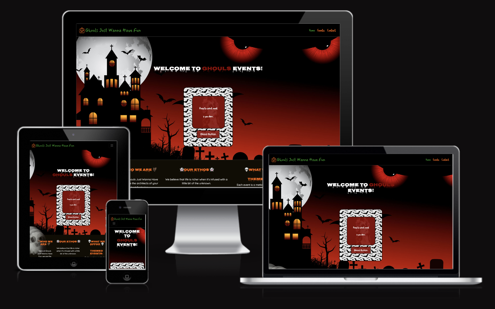
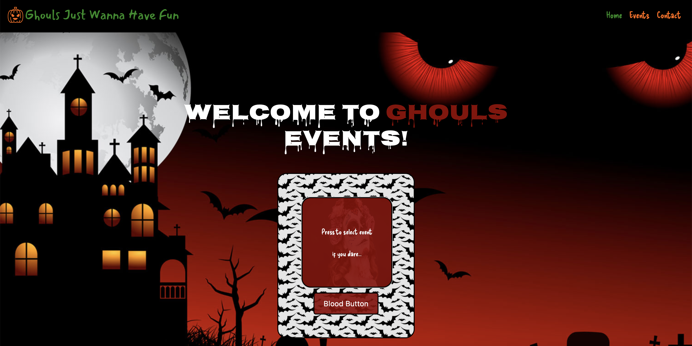
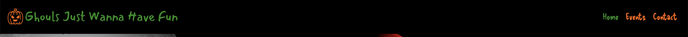
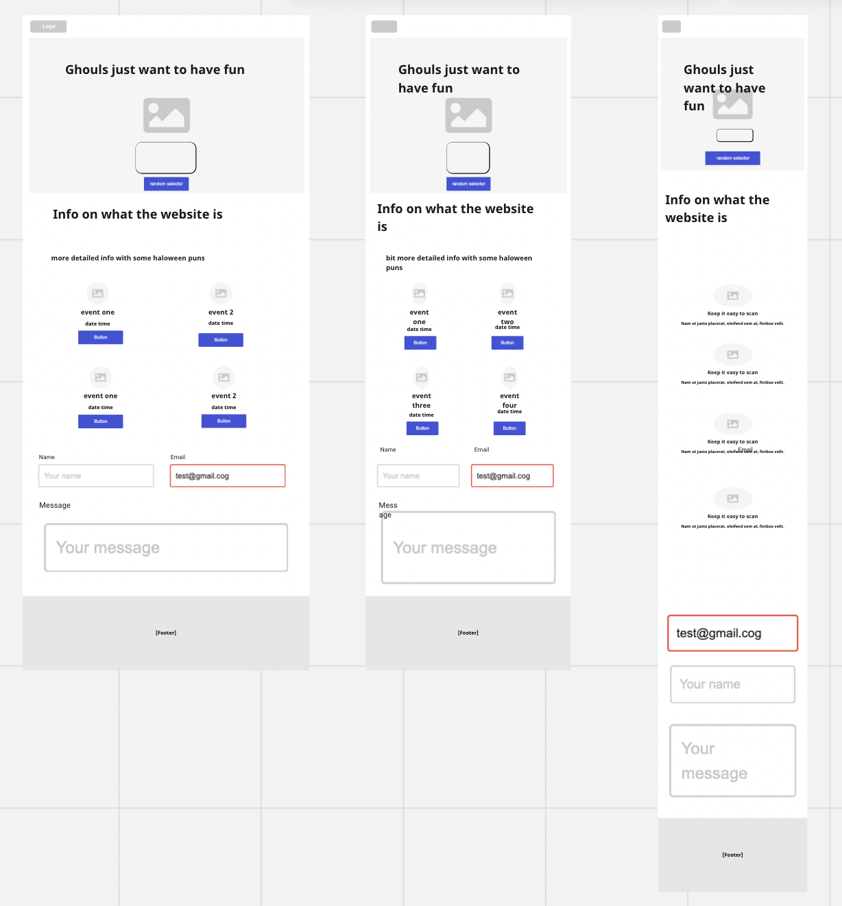

<h1 align="center"><strong>🎃🎃🎃 Phantom Forge: A Halloween Hackathon 🎃🎃🎃</strong>

</h1>

# Ghouls Just Wanna Have Fun

[View live project here](https://lee-joanne.github.io/ghouls-just-wanna-have-fun/)

## Table of Contents

- [Introduction](#introduction)
- [Features](#features)
- [Design](#design)
- [Technologies Used](#technologies-used)
- [User Experience (UX)](#user-experience-ux)
- [Wireframes](#wireframes)
- [Contact Page](#contact-page)
- [Events](#events)
- [Events Detail Page & Modal Window](#events-detail-page--modal-window)
- [404 Page](#404-page)
- [Responsive Webpages](#responsive-webpages)
- [Deployment](#deployment)
- [Credits](#credits)

## Introduction

Welcome to **Ghouls Just Wanna Have Fun**, where we make your darkest fantasies come to life. We are a passionate team dedicated to crafting supernatural and spine-chilling experiences. If you thirst for the eerie and crave the paranormal, you're in the right place.

Our mission is to blur the line between reality and the supernatural, taking you on a journey into the unknown. From hair-raising haunted houses to cryptic escape rooms, our immersive events will transport you to the heart of the unexplained.

## Goal

The primary aim of this project is to address the challenge of limited access to a diverse range of themed spooky events. We seek to bridge the gap between enthusiasts and engaging, interactive events in the world of the supernatural.

### Problem Statement

Annually, millions of individuals face the difficulty of discovering thrilling and immersive spooky events, as well as identifying their locations. This project is dedicated to resolving this issue by curating a collection of captivating images and event ideas.

### Objective(s)

The key objectives of this project encompass the following aspects:

- Providing an extensive array of high-quality spooky events to cater to diverse interests.
- Captivating the audience through the allure of high-quality visuals and event concepts.

Through this project, we aspire to connect enthusiasts with a wide range of spooky events, making it easier to find and participate in thrilling experiences.

## Features

### Themed Events

- Each of our events is a meticulously crafted masterpiece, featuring an array of eerie themes and chilling settings, from gothic castles to abandoned asylums.

### Immersive Experiences

- We take pride in our attention to detail, weaving rich narratives that will have you questioning the boundaries of reality.

### Professional Performers

- Our team of talented actors, illusionists, and paranormal experts will keep you spellbound from the moment you arrive.

### Customization

- We'll work closely with you to ensure your event is tailor-made to your darkest desires and requirements.

### Seasonal Spooks

- Whether it's Halloween, Friday the 13th, or any other occasion, we'll make sure your event is a chilling success.

## Design

Our website's design reflects the mysterious and chilling nature of our events. We've incorporated hauntingly beautiful visuals, a dark color scheme, and eerie fonts to immerse visitors in the supernatural.

## Technologies Used

### Languages Used

- HTML5
- CSS3
- JavaScript

### Frameworks, Libraries & Programs Used

- Bootstrap: For creating responsive web pages.

## User Experience (UX)

### User Stories

1. **Responsive Webpages (#25)**
   - As a user, I can effectively browse the webpage on mobile, tablet, and desktop devices, ensuring ease of access on any device.

2. **Events Page (#13)**
   - As a user, I can view the events on a separate page to see what events the business offers.

   

3. **404 Page (#10)**
   - As a user, I can view a 404 page when reaching a non-existent link for a more friendly-format view and redirection to the website.

4. **Contact Page (#6)**
   - As a user, I can visit the contact page and send an email to the business to get in touch if I have further questions.

   

5. **Events Detail Page & Modal Window (#5)**
   - As a user, I can view detailed information about each event on a modal window, making it convenient to understand the events without navigating to another page.

6. **Homepage (#3)**
   - As a user, I can view the about page on the homepage to better understand what the business is and what it offers.

   

7. **Easter Eggs (#2)**
   - As a user, I can discover fun Halloween-themed easter eggs throughout the website for an engaging experience.

8. **Navigation Bar (#1)**
   - As a user, I can access the navigation bar with ease to navigate to various pages across the website.

   

## Wireframes

The wireframes for our website were created to ensure an organized development process. They include desktop, tablet, and mobile views for various pages.

## Contact Page

The contact page allows users to send emails to the business for inquiries, providing a direct channel for communication.

## Events

We offer a variety of themed events, each meticulously crafted to immerse you in a world of the supernatural. From haunted houses to escape rooms, we've got the eerie experiences you crave.

## Events Detail Page & Modal Window

Users can explore detailed information about each event on a modal window, making it convenient to understand the events without navigating to another page.

## 404 Page

In the event of a non-existent link, users will be greeted with a user-friendly 404 page, offering redirection to the website.

## Responsive Webpages

Our website is fully responsive, ensuring an optimal user experience on mobile, tablet, and desktop devices.

## Deployment

The website was deployed using GitHub Pages. The following steps were taken for the deployment process:

  1. Log in to **[GitHub](https://github.com/)**.
  2. Click on the profile icon to locate **'Your repositories'**. 
  3. On the repository page, click on the repository you wish to deploy.
  4. At the top of the repository, locate the **'Settings'** link and click.
  5. On the Settings page, locate the **'Pages'** section in the left-hand navigation section and click.
  6. On the GitHub Pages page, under **'Source'** click **'Main'**. Click **'Save'**.
  7. Refresh the page and the live link is ready. 

  [View live project here](https://lee-joanne.github.io/ghouls-just-wanna-have-fun/)

  The following steps were taken for the cloning process: 

  1. Log in to **[GitHub](https://github.com/)**.
  2. Click on the profile icon to locate **'Your repositories'**. 
  3. On the repository page, click on the repository you wish to clone.
  4. Under **'Code'**, see the different cloning options, HTTPS, SSH, and GitHub CLI. Click the prefered cloning option, and then copy the link provided. 
  5. Open **Terminal**.
  6. In Terminal, change the current working directory to the desired location of the cloned directory.
  7. Type git clone, and then paste the URL copied from GitHub earlier. 
  8. Type **Enter** to create the local clone. 

## Credits

### Acknowledgments

- Thanks to our dedicated team for bringing these eerie experiences to life.
- Special thanks to our community for their support.

## Conclusion

Thank you for exploring **Ghouls Just Wanna Have Fun**. We look forward to immersing you in the supernatural and creating unforgettable, spine-chilling memories.
